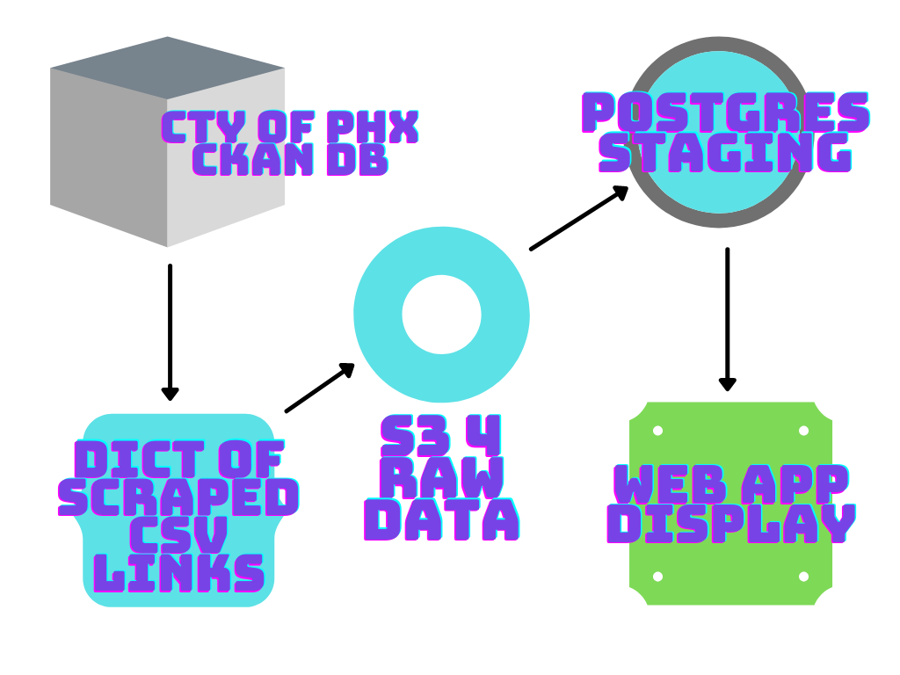

# City of Phoenix Open Data Engineering

  

## Overview Motivation  

This project will serve to highlight the data engineering process. I will automate the collection of the City of Phoenix City Checkbook fiance data from their Open Data website. It will then be processed through a data pipeline where a model will be applied and the results broadcast through a web application.  

Below is an outline of the data engineering pipeline  
  

## Setting up an S3 bucket  

I am going to use an S3 bucket as the first stop on my data pipeline journey. The S3 bucket will be useful to collect the raw data from the City of Phoenix city checkbook as is. This means that there will not be any data transformation (aka business logic) applied to the data at this step.

First, you will navigate to AWS cloud services site [here](https://aws.amazon.com/). Create an account if you don't already have one, then log in. Once you are logged in you should see a Services dropdown in the upper left corner of the page, click it. Select the S3 option under the Storage category. Next, click Create Bucket, name it appropriately and you are off to the races.  
[Here](https://www.youtube.com/watch?v=fc05rd0iZhM) is a nice YouTube video for more assistance.

## Creating an EC2 instance  

Ubuntu Server 20.04 LTS (HVM), SSD Volume Type - ami-03d5c68bab01f3496 (64-bit x86) / ami-09d9c897fc36713bf (64-bit Arm)
Ubuntu Server 20.04 LTS (HVM),EBS General Purpose (SSD) Volume Type. Support available from Canonical (http://www.ubuntu.com/cloud/services).  
t2.micro instance type 

